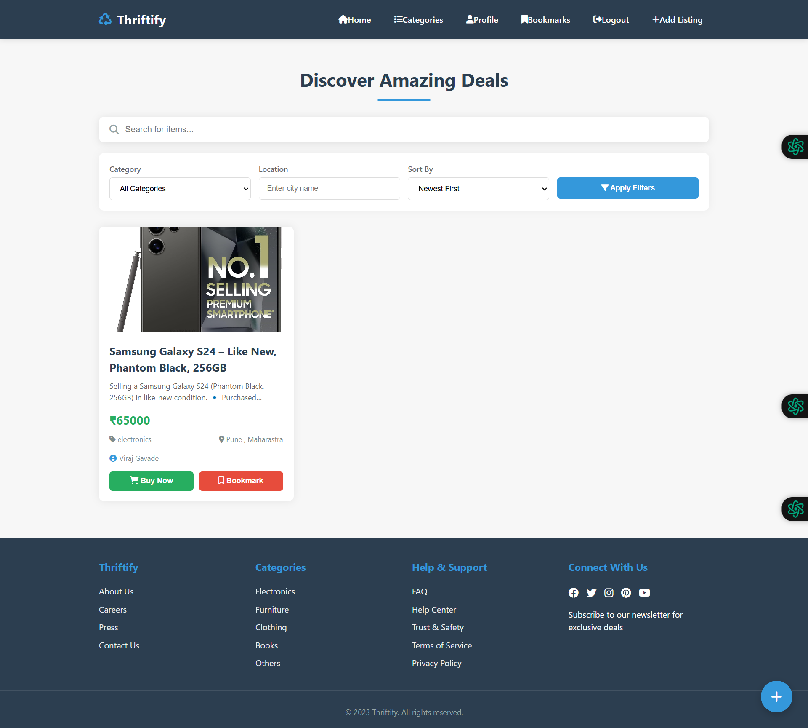
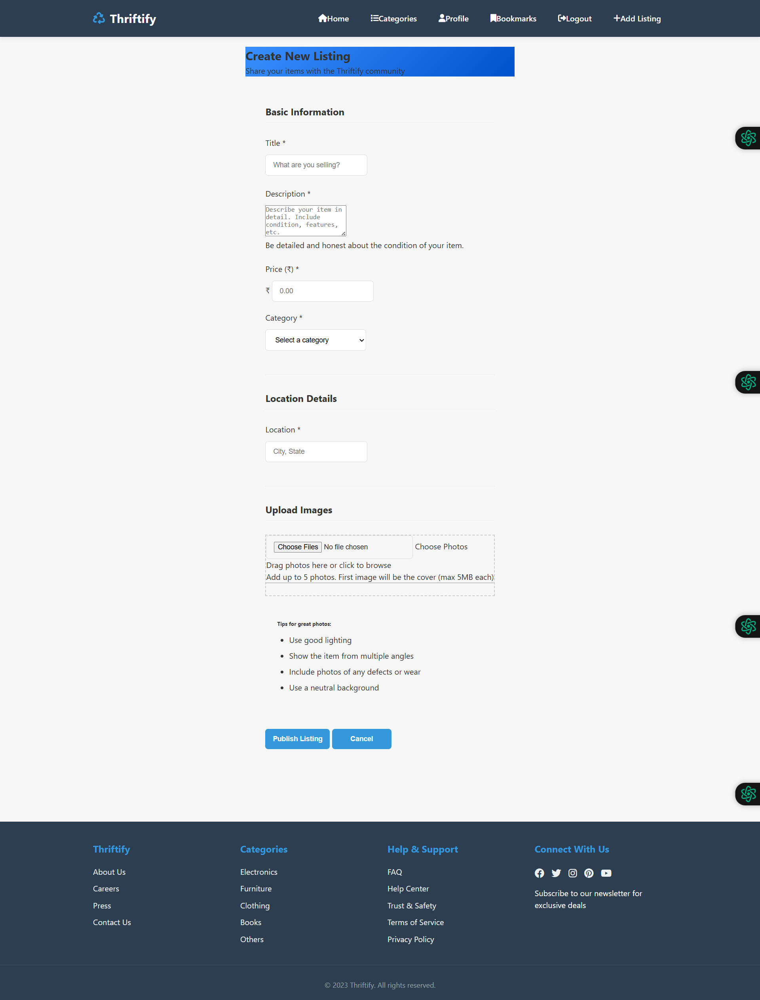
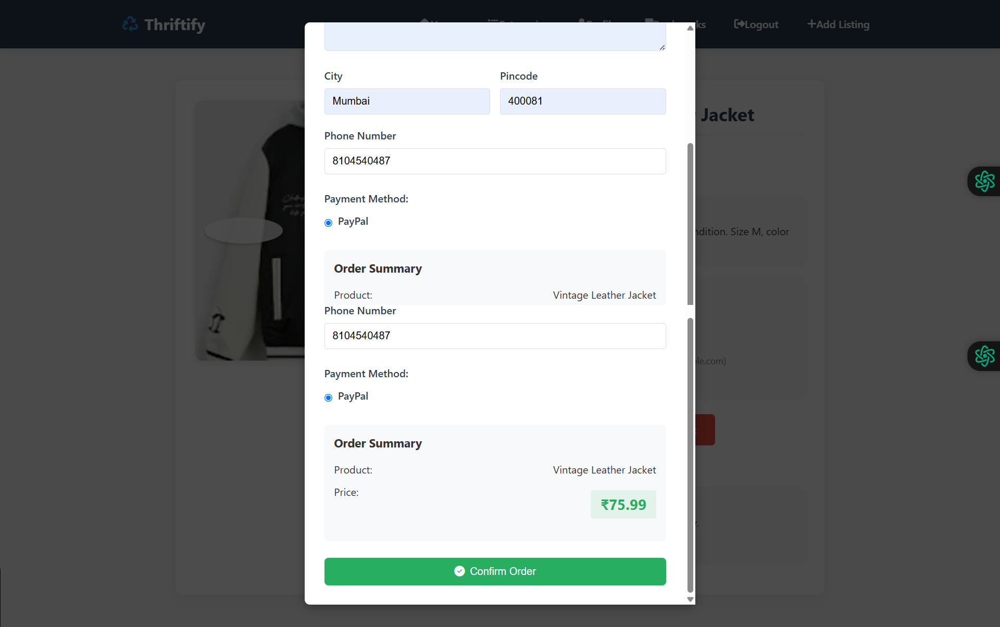

# Thriftify 🛒

Thriftify is an online marketplace platform for buying and selling second-hand items, promoting sustainability through reuse and reducing waste.


## 🚀 Demo

[Live Demo](https://thriftify.onrender.com/)

## ✨ Features

- **User Authentication:** Secure registration and login system with JWT
- **Product Listings:** Create, view, update, and delete listings with image uploads
- **Categories:** Browse items by categories (electronics, furniture, clothing, books, others)
- **Search & Filters:** Find items by location, category, price, etc.
- **Bookmarks:** Save favorite items for later
- **Messaging:** Real-time chat between buyers and sellers
- **Payment Integration:** Secure checkout with PayPal/Razorpay
- **Order Management:** Track purchases and sales
- **Responsive Design:** Works on desktop and mobile devices
- **User Profiles:** Customizable user profiles with profile pictures

## 💻 Tech Stack

### Backend
- Node.js
- Express.js
- MongoDB (Mongoose)
- JWT for authentication
- Cloudinary for image storage
- PayPal/Razorpay API for payment integration
- Swagger for API documentation

### Frontend
- EJS templates
- JavaScript
- CSS
- Responsive design components

## 🔧 Installation

### Prerequisites
- Node.js (v14+)
- MongoDB
- npm or yarn

### Setup Steps

1. Clone the repository
```bash
git clone https://github.com/yourusername/thriftify.git
cd thriftify
```

2. Install dependencies
```bash
npm install
```

3. Create a `.env` file in the root directory with the following variables:
```
PORT=3000
MONGODB_URI=mongodb://localhost:27017/thriftify
ACCESS_TOKEN_SECRETE=your_jwt_secret_key
CLOUDINARY_CLOUD_NAME=your_cloudinary_name
CLOUDINARY_API_KEY=your_cloudinary_key
CLOUDINARY_API_SECRET=your_cloudinary_secret
PAYPAL_CLIENT_ID=your_paypal_client_id
PAYPAL_CLIENT_SECRET=your_paypal_client_secret
```

4. Start the server
```bash
npm start
```

5. For development with auto-reload:
```bash
npm run dev
```

6. Visit `http://localhost:3000` in your browser

## 📚 API Documentation

Thriftify provides comprehensive API documentation using Swagger UI.

### Accessing Swagger Documentation

When running the application locally, you can access the Swagger documentation at:
```
http://localhost:3000/api-docs
```

You can also access the Swagger documentation on the deployed version:
```
https://thriftify.onrender.com/api-docs
```

### Key Endpoints

#### User Endpoints

- **POST /api/v1/user/register** - Register a new user
- **POST /api/v1/user/login** - Login and receive authentication token
- **GET /api/v1/user/profile** - Get current user profile
- **PUT /api/v1/user/profile** - Update user profile

#### Listing Endpoints

- **GET /api/v1/listings** - Get all listings with optional filters
- **POST /api/v1/listings** - Create a new listing
- **GET /api/v1/listings/:id** - Get specific listing details
- **PUT /api/v1/listings/:id** - Update a listing
- **DELETE /api/v1/listings/:id** - Delete a listing

#### Bookmark Endpoints

- **GET /api/v1/bookmarks** - Get all bookmarks for current user
- **POST /api/v1/bookmarks/:listingId** - Add a listing to bookmarks
- **DELETE /api/v1/bookmarks/:listingId** - Remove a listing from bookmarks

#### Order Endpoints

- **POST /api/v1/orders/create** - Create a new order
- **GET /api/v1/orders** - Get all orders for current user
- **GET /api/v1/orders/:id** - Get specific order details

#### Category Endpoints

- **GET /api/v1/category/:category** - Get listings by category

#### Support Endpoint

- **POST /api/v1/support/submit** - Submit a support request

## 🗄️ Database Schema

### User

- `username`: String (unique)
- `email`: String (unique)
- `fullname`: String
- `password`: String (hashed)
- `profilepic`: String
- `createdAt`: Date
- `updatedAt`: Date

### Listing

- `title`: String
- `description`: String
- `price`: Number
- `category`: String (enum: electronics, furniture, clothing, books, others)
- `location`: String
- `images`: [String]
- `postedBy`: ObjectId (reference to User)
- `status`: String (available, sold)
- `createdAt`: Date
- `updatedAt`: Date

### Bookmark

- `user`: ObjectId (reference to User)
- `listing`: ObjectId (reference to Listing)
- `createdAt`: Date

### Order

- `buyer`: ObjectId (reference to User)
- `listing`: ObjectId (reference to Listing)
- `seller`: ObjectId (reference to User)
- `paymentId`: String
- `shippingInfo`: Object
- `paymentMethod`: String
- `status`: String (pending, completed, cancelled)
- `createdAt`: Date
- `updatedAt`: Date

## 📁 Project Structure

```
thriftify/
├── DataBase/
│   └── connect.js
├── Routes/
│   ├── bookmark.router.js
│   ├── category.router.js
│   ├── listing.router.js
│   ├── orders.router.js
│   └── user.router.js
├── Schemas/
│   ├── bookmark.schemas.js
│   ├── category.schemas.js
│   ├── listings.schemas.js
│   ├── order.schemas.js
│   └── user.schemas.js
├── utils/
│   └── asynchandler.js
├── views/
│   ├── chat.ejs
│   ├── home.ejs
│   ├── index.ejs
│   ├── payment-cancel.ejs
│   └── payment-success.ejs
├── public/
│   ├── css/
│   ├── js/
│   └── images/
├── app.js
├── swagger.js
├── .env.example
├── package.json
└── README.md
```

## 🚀 Deployment

Thriftify is deployed on Render:

- **Production URL**: [https://thriftify.onrender.com](https://thriftify.onrender.com)

### Deployment Steps:

1. Create a new Web Service on Render
2. Connect your GitHub repository
3. Add environment variables in the Render dashboard
4. Set the build command to `npm install`
5. Set the start command to `npm start`

## 🔒 Authentication

Thriftify uses JSON Web Tokens (JWT) for authentication:
- Tokens are stored in HTTP-only cookies for security
- Protected routes require valid authentication
- User sessions expire after a configured period

## 🤝 Contributing

1. Fork the repository
2. Create your feature branch (`git checkout -b feature/amazing-feature`)
3. Commit your changes (`git commit -m 'Add some amazing feature'`)
4. Push to the branch (`git push origin feature/amazing-feature`)
5. Open a Pull Request

## 📄 License

This project is licensed under the MIT License - see the LICENSE file for details.

## 📞 Contact

Project Link: [https://github.com/yourusername/thriftify](https://github.com/yourusername/thriftify)

### Connect with Me
- 📸 Instagram: [@yourinstagram](https://instagram.com/yourinstagram)
- 🐦 Twitter: [@yourtwitter](https://twitter.com/yourtwitter)
- 💼 LinkedIn: [Your Name](https://linkedin.com/in/yourlinkedin)

## 📷 Screenshots

Here are some screenshots of the Thriftify application:

### Homepage


### Product Listing


### User Dashboard


### Payment Gateway

